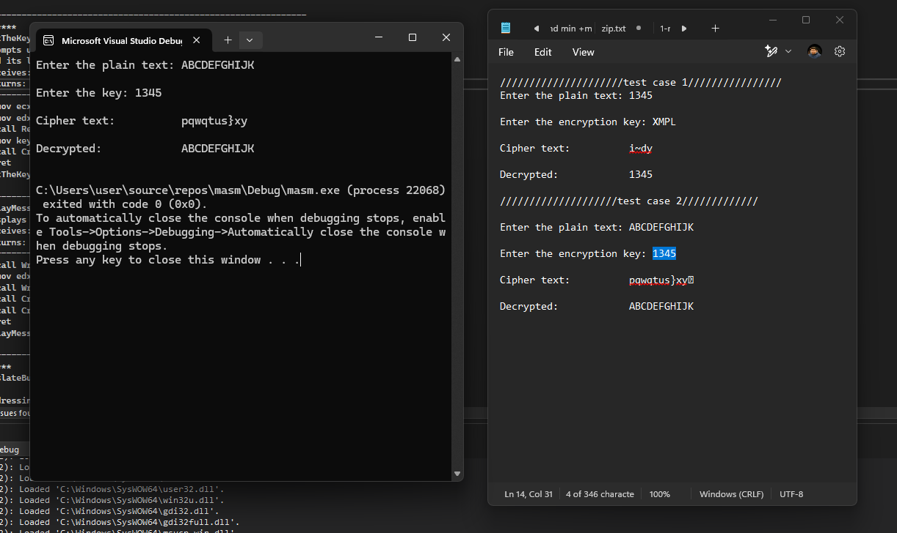

# Text-Encryption-and-Decryption-System

Developed a text encryption/decryption application in MASM Assembly, focusing on XOR methods using using modulo arithmetic 

## TranslateBuffer Program Execution Visual Explanation

